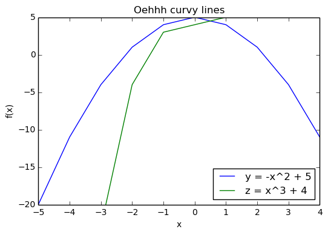

# Week 4 - Tuesday

## Recap on previous assignment
Interactive session, I will code the annual average part of the assignment live in the class.

## Programming Structure Basics


```python
# Functions

def say_hello():
    """Print 'Hello!'"""
    print 'Hello!'

def is_even(n):
    """Return True if n is an even number
    
    Keyword params:
    n -- integer input number
    """
    return n % 2 == 0

say_hello()

for i in range(10):
    print i, is_even(i)
```

    Hello!
    0 True
    1 False
    2 True
    3 False
    4 True
    5 False
    6 True
    7 False
    8 True
    9 False


```python
# Scope

# This is a global variable
a = 0
b = 2

if a == 0:
    # This is still a global variable
    b = 1

def my_function(c):
    # this is a local variable
    d = 3
    print(c)
    print(d)

# Now we call the function, passing the value 7 as the first and only parameter
my_function(7)

# a and b still exist
print(a)
print(b)

# c and d don't exist anymore -- these statements will give us name errors!
print(c)
print(d)
```

    7
    3
    0
    1


    ---------------------------------------------------------------------------

    NameError                                 Traceback (most recent call last)

    <ipython-input-3-1a4f236d369e> in <module>()
         23 
         24 # c and d don't exist anymore -- these statements will give us name errors!
    ---> 25 print(c)
         26 print(d)


    NameError: name 'c' is not defined


```python
a = 0

def my_function():
    a = 3
    print(a)

my_function()

print(a)
```

    3
    0


### Modules

The `if __name__ == "__main__":` construct and importing files. See live session.


```python
# Documentation

def my_function():
    """Return a foobang

    Optional plotz says to frobnicate the bizbaz first.
    """
    
    return "foobang"    
```


```python
# Error handling

import sys

try:
    f = open('myfile.txt')
    s = f.readline()
    i = int(s.strip())
except IOError as err:
    print "I don't care, continue to function"
except OSError as err:
    print("OS error: {0}".format(err))
except ValueError:
    print("Could not convert data to an integer.")
except:
    print("Unexpected error:", sys.exc_info()[0])
    raise
    
print "continuing..."
```

    I don't care, continue to function
    continuing...


```python
# Assertions

def fac(n):
    assert(n > 0)
    
    v = 1
    for i in range(n):
        v *= (i+1)
    return v

print fac(5)  # computes fine
print fac(2) # raises assertion
```

    120
    2


```python
# Matplotlib - create glorious plots and graphs

%matplotlib inline
from matplotlib import pyplot

x = range(-5, 6)
y = [-v**2 + 5 for v in x]
z = [v**3 + 4 for v in x]
pyplot.plot(x,y,label='y = -x^2 + 5')  # label of the data
pyplot.plot(x,z,label='z = x^3 + 4')   # label of the data
pyplot.title("Oehhh curvy lines")      # title
pyplot.xlabel("x")                     # label on x axis
pyplot.ylabel("f(x)")                  # label on y axis
pyplot.axis([-5, 4, -20, 5])           # min and max of both x and y axis
pyplot.legend(loc=4)                   # location in one of four corners
pyplot.show()                          # render all that glory
```





## PEP 8 -- Style Guide

From here on we will care deeply about your code (read: grade your code) on the following:

* Does it do what it's supposed to do, is it functionally correct `(6)`
* Does it handle invalid input properly `(1)`
* Is it in compliance with PEP 8 `(3)`

Read about PEP8 here https://www.python.org/dev/peps/pep-0008/. You can use the program `pep8` to validate your sourcecode, example:

    pep8 myparser.py
    
Or you can use the online validator http://pep8online.com/
