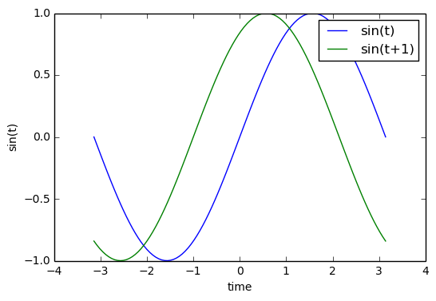
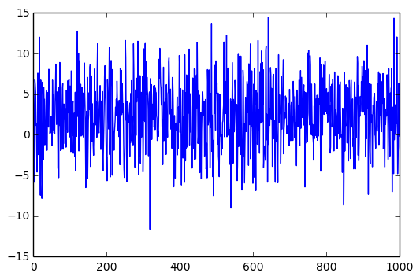

# Week 5 - Tuesday

## Recap on previous assignment

- Use pep8! Do it! Please!
- Label the axes of you plots
- Do a bit of error handling. Assert that arrays have the same length before plotting, check if files exist, etc.


## Numpy


```python
%matplotlib inline
from matplotlib import pyplot as pl
import numpy as np

x = np.linspace(-np.pi, np.pi, 100)
y = np.sin(x)
z = np.sin(x+1)
pl.plot(x,y)
pl.plot(x,z)
pl.xlabel('time')
pl.ylabel('sin(t)')
pl.legend(['sin(t)', 'sin(t+1)'])
pl.show()
```





```python
# Numpy has a gazillion functions that you can apply to arrays, similar to matlab
data = np.genfromtxt('week5/10.45N-107.18E-TAVG-Trend.txt', comments='%', usecols=(0, 1, 2, 3),
                     dtype=None, names=('year', 'month', 'anomaly', 'error'))

print data.shape
print data[0]
print data[-1]
x = np.array(data[-1], dtype=np.float32)
print x
print np.isnan(x)
```

    (2265,)
    (1825, 1, 0.041, 2.275)
    (2013, 9, nan, nan)
    2013.0
    False


```python
data = np.random.normal(loc=2.5, scale=4, size=(1000,))
pl.plot(data)
print np.std(data), np.mean(data)
```

    3.93713111923 2.49650267181





```python
data = np.random.rand(3,3)
print data
print ""
data[data > 0.5] = 5
print data
print ""
indices = data < 1
print indices
print ""
print data[indices]
```

    [[ 0.71703039  0.40352454  0.85050793]
     [ 0.38050593  0.70496947  0.16880397]
     [ 0.40128175  0.37853409  0.13969117]]
    
    [[ 5.          0.40352454  5.        ]
     [ 0.38050593  5.          0.16880397]
     [ 0.40128175  0.37853409  0.13969117]]
    
    [[False  True False]
     [ True False  True]
     [ True  True  True]]
    
    [ 0.40352454  0.38050593  0.16880397  0.40128175  0.37853409  0.13969117]


### PEP 8 -- Style Guide

Repeat after me: From here on we will care deeply about your code (read: grade your code) on the following:

* Does it do what it's supposed to do, is it functionally correct `(7)`
* Is it in compliance with PEP 8 `(3)`

Read about PEP8 here https://www.python.org/dev/peps/pep-0008/. You can use the program `pep8` to validate your sourcecode, example:

    pep8 myfile.py
    
Or you can use the online validator http://pep8online.com/
