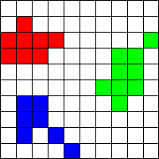

## Sourcefinder (2/3)
Using our sigmaclipping and RMS map functions we will continue our work on creating a source finder. This week we will use our sigmaclipped rmsmap to find islands in our image that define our sources. We will implement two functions.

  1. Implement the function `fit_nearest(rmsmap, cols, rows)` that given the `rmsmap` returns an interpolated map using nearest neighbour interpolation [see wikipedia](https://en.wikipedia.org/wiki/Nearest-neighbor_interpolation) with `cols x rows` resolution.

  2. After filtering out the noise using our interpolated rmsmap, we will look for islands in the remaining data. Implement the function `find_islands(data)` that returns a list of positions. Each position is a tuple $$(x, y)$$ containing the center position of that island. 

Please download [rmsfit.py](rmsfit.py) and [sigmaclip.py](sigmaclip.py) and implement the functions in `rmsfit.py`. Have fun!

### Hints
For finding islands I suggest you use the following approach:

  * Create a list of tuples containing valid positions, i.e. positions that contain finite values.
  * Create a function `expand(pos, used, valid)` that returns all neighbours (max 8) around `pos` which are `valid` and not `used`
  * For each valid position check if a position is used already, otherwise expand until there are no more expansions possible (this is where a while loop is useful)

The image above shows 3 islands as an example. For each you should compute and store the arithmetic mean. For grading however, we will not be very strict on where this mean lies exactly. Your mean can differ from the correct mean by ~3 pixels.
